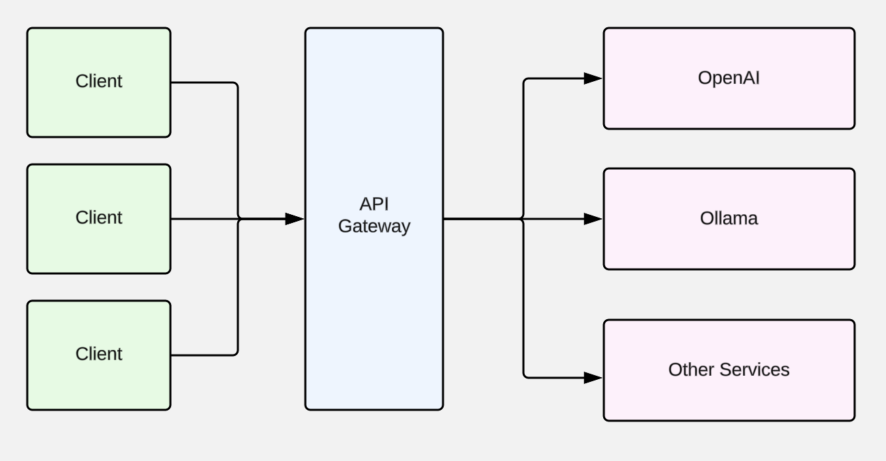
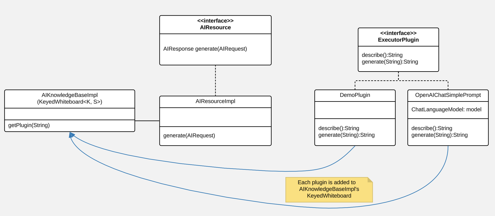

# Apache Karaf LangChain4J Application Demo

In this demo we’ll build an [API Gateway
Service](https://microservices.io/patterns/apigateway.html) which allows
our users to utilize various Generative API services.

<figure>

</figure>

To implement this pattern we’ll use [Apache
Karaf](https://karaf.apache.org/) as our runtime container, [Apache
CXF](https://cxf.apache.org/) as our JAX-RS webservice implementation,
Savoirtech’s [EOS library](https://github.com/savoirtech/eos) to
implement a Keyed-Whiteboard plugin-architecture, and
[LangChain4J](https://docs.langchain4j.dev/) to integrate various
Generative API Services.

## Architecture Overview:

When working with microservices we implement an API Gateway Service to
simplify clients accessing many down stream services via a single entry
point. This service can then either directly proxy to a requested
service, or handle the orchestration of multiple services required for
the call.

A Keyed-Whiteboard plugin architecture allows developers to encapsulate
specific functionality into discrete deployable units of code. In our
demo we will assign each plugin a specific Generative AI service to
provide services upon. Our end users will only need to know which plugin
they desire to use, but not the specifics (or API KEYS) to use them. In
Enterprise development teams, this leads to an expert group being able
to manage these assets in a consistent manner.

<figure>

</figure>

LangChain4J eases interaction with LLMs and Vector Stores, providing a
toolbox for common LLM operations. Utilizing LangChain4J we can
implement plugin logic for prompt templating, chat memory management,
output parsing, or higher level patterns such as AI Service and
Retrieval Augmented Generation (RAG).

Our modular architecture is deployed via an Apache Karaf Feature
descriptor. Here our developers can manage the dependencies of the
overall application, ensuring a smooth runtime experience. Our itests
module contains KarafTestSupport to help automate wiring testing.

## Code Review:

### API

The Application Programming Interface module contains our user facing
interface. Note that we do not directly expose LangChain4J OR AI
Services structures to end users, our clients do not need to be
concerned with those implementation details.

``` java
public interface AIResource {
    AIResponse generate(AIRequest AIRequest);
}
```

### SPI

The Service Provider Interface module contains our ExecutorPlugin
interface. Developers will implement this interface for each service
workflow.

``` java
public interface ExecutorPlugin {

    /**
     * This method returns a human-readable description of the plugin purpose
     * @return String description.
     */
    String describe();

    /**
     * This method takes in a text prompt, and returns generated text.
     * @param prompt submission.
     * @return generated text
     */
    String generate(String prompt);
}
```

### Plugins

A demo plugin has been created to show how the ExecutorPlugin SPI may be
implemented. A second plugin was created to show how a simple prompt
workflow can be implemented with OpenAI.

#### Demo Plugin:

``` java
public class DemoPlugin implements ExecutorPlugin {

    public DemoPlugin() {
        //
    }

    @Override
    public String describe() {
        return "This is a demo plugin.";
    }

    @Override
    public String generate(String prompt) {
        return "Sample generate for prompt: " + prompt;
    }
}
```

#### OpenAiChatSimplePrompt Plugin:

``` java
public class OpenAiChatSimplePrompt implements ExecutorPlugin {

    ChatLanguageModel model;

    public OpenAiChatSimplePrompt() {
        model = OpenAiChatModel.withApiKey("demo");
    }

    @Override
    public String describe() {
        return "This is an OpenAi Chat Simple Prompt plugin.";
    }

    @Override
    public String generate(String prompt) {
        return model.generate(prompt);
    }
}
```

#### Note to Developers

As not all libraries for AI Service integration are OSGi-Ready, in our
demo we embed their dependencies into the plugin bundle (see maven
bundle plugin configuration). This simplifies resolution, and runtime
wiring at the low cost of a larger bundle jar.

### Impl

At the core of our service we implement generic workflows using our
defined plugin. Our service will query a local knowledge base to find
registered plugin, if it does not exist a suitable error is may be
thrown.

``` java
public AIResponse generate(AIRequest AIRequest) {
    LOGGER.info("Got request: {}, {}, {}", AIRequest.getId(), AIRequest.getPlugin(), AIRequest.getPrompt());
    try {
        ExecutorPlugin executorPlugin = knowledgeBase.getPlugin(AIRequest.getPlugin());
        return new AIResponse(executorPlugin.generate(AIRequest.getPrompt()));
    } catch (Exception exception) {
        LOGGER.error("Unknown plugin");
    }
    return null;
 }
```

## Demo Setup:

Set JAVA_HOME and MAVEN_HOME, adding them to the system PATH.

For our demo, we’ll use Java 17.

Download Apache Karaf 4.4.6, extract the kit, and start the runtime from
the bin folder.

To build the demo, run the following command:

``` bash
mvn clean install
```

This will result in a reactor summary similar to below:

``` bash
[INFO] ------------------------------------------------------------------------
[INFO] Reactor Summary for Apache-Karaf-LangChain4J-AI-DEMO 1.0.0-SNAPSHOT:
[INFO]
[INFO] Apache-Karaf-LangChain4J-AI-DEMO ................... SUCCESS [  0.156 s]
[INFO] Apache-Karaf-LangChain4J-AI-DEMO :: api ............ SUCCESS [  0.937 s]
[INFO] Apache-Karaf-LangChain4J-AI-DEMO :: spi ............ SUCCESS [  0.151 s]
[INFO] Apache-Karaf-LangChain4J-AI-DEMO :: plugins ........ SUCCESS [  6.403 s]
[INFO] Apache-Karaf-LangChain4J-AI-DEMO :: impl ........... SUCCESS [  0.217 s]
[INFO] Apache-Karaf-LangChain4J-AI-DEMO :: karaf-features-file SUCCESS [  0.051 s]
[INFO] Apache-Karaf-LangChain4J-AI-DEMO :: karaf-feature-project-itests SUCCESS [ 36.615 s]
[INFO] ------------------------------------------------------------------------
[INFO] BUILD SUCCESS
[INFO] ------------------------------------------------------------------------
[INFO] Total time:  44.917 s
[INFO] Finished at: 2024-09-01T15:36:23-02:30
[INFO] ------------------------------------------------------------------------
```

## Installation:

``` bash
feature:repo-add mvn:com.savoir/application-features-file/1.0.0-SNAPSHOT/xml/features
feature:install application-all-demo
```

## Verify Installation:

``` bash
karaf@root()> list
START LEVEL 100 , List Threshold: 50
 ID │ State  │ Lvl │ Version        │ Name
────┼────────┼─────┼────────────────┼────────────────────────────────────────────────────────────────────────────────────
 33 │ Active │  80 │ 4.4.6          │ Apache Karaf :: OSGi Services :: Event
106 │ Active │  85 │ 1.0.0.SNAPSHOT │ Apache-Karaf-LangChain4J-AI-DEMO :: api
107 │ Active │  85 │ 1.0.0.SNAPSHOT │ Apache-Karaf-LangChain4J-AI-DEMO :: impl
108 │ Active │  85 │ 1.0.0.SNAPSHOT │ Apache-Karaf-LangChain4J-AI-DEMO :: plugins
109 │ Active │  85 │ 1.0.0.SNAPSHOT │ Apache-Karaf-LangChain4J-AI-DEMO :: spi
110 │ Active │  80 │ 2.10.1         │ Gson
111 │ Active │  80 │ 18.0.0         │ Guava: Google Core Libraries for Java
112 │ Active │  80 │ 1.1.0          │ SavoirTech :: Eos :: Core
120 │ Active │  80 │ 3.4.0          │ Apache Commons Lang
128 │ Active │  80 │ 0              │ wrap_file__Users_jgoodyear_.m2_repository_com_knuddels_jtokkit_1.1.0_jtokkit-1.1.0.jar
karaf@root()>
```

### Verify webservice available:

``` bash
http://localhost:8181/cxf/
```

## Test our webservice:

Our first test will be to verify that our demo plugin is wired, and
responds to the request.

``` bash
curl --location --request POST 'http://0.0.0.0:8181/cxf/ai' \
--header 'Content-Type: application/json' \
--data-raw '
{
  "id": 1234567890,
  "plugin": "demo",
  "prompt": "test"
}'
```

Our demo plugin received the 'test' prompt input and returned a canned
response.

``` bash
{"response":"Sample generate for prompt: test"}
```

Next we will send a request to the openAiChatSimplePrompt plugin.

In the prompt field we supply a request for the plugin to generate a
joke about Java.

``` bash
curl --location --request POST 'http://0.0.0.0:8181/cxf/ai' \
--header 'Content-Type: application/json' \
--data-raw '
{
  "id": 1234567890,
  "plugin": "openAiChatSimplePrompt",
  "prompt": "Tell a joke about Java."
}'
```

Our plugin talks to OpenAI, and returns a response:

``` bash
{"response":"Why did the Java developer go broke?\n\nBecause he couldn't C# his way out of a for loop!"}
```

## Future Work:

Our API Gateway Service currently contains a demo plugin to show control
flow to developers, and a simple text based prompt for OpenAI.
Developers can take this demo and extend it by implementing new plugins
for various Generative AI systems (LangChain4J can help in this effort).
Given our plugin architecture, each of these integrations can be managed
independently & deployed in Apache Karaf.

### Note to Developers

Changes the API/SPI will need to be reflected on implemented plugins.
When adding methods which are not supported by particular AI services,
one can have that plugin return an appropriate error.

# About the Authors

[Jamie
Goodyear](https://github.com/savoirtech/blogs/blob/main/authors/JamieGoodyear.md)

# Reaching Out

Please do not hesitate to reach out with questions and comments, here on
the Blog, or through the Savoir Technologies website at
<https://www.savoirtech.com>.

# With Thanks

Thank you to the Apache Karaf, and LangChain4J communities.

\(c\) 2024 Savoir Technologies
